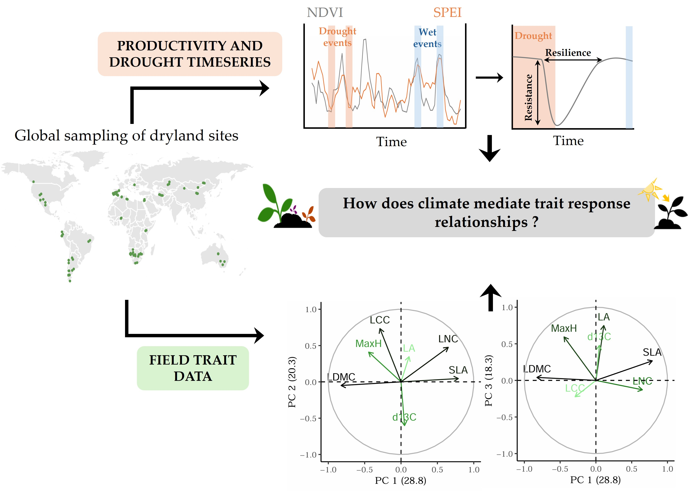
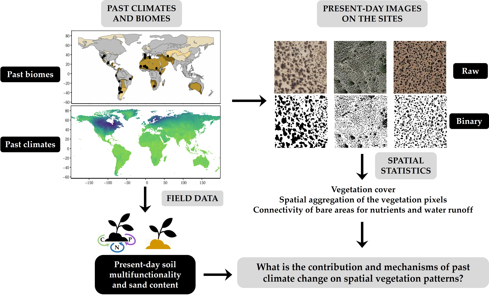
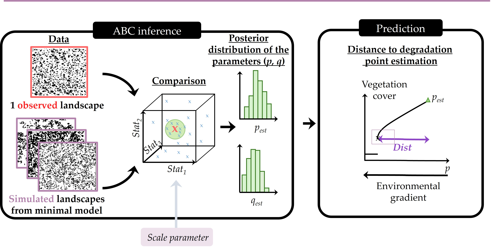
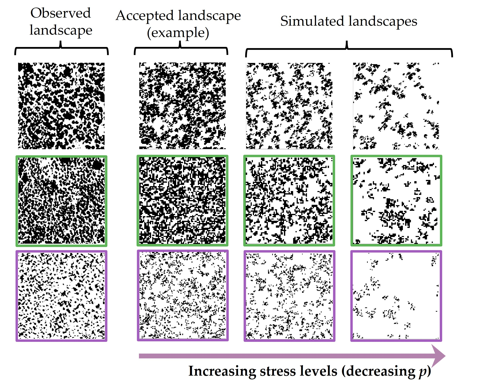
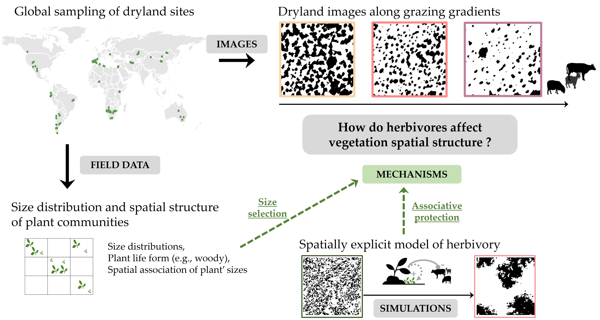
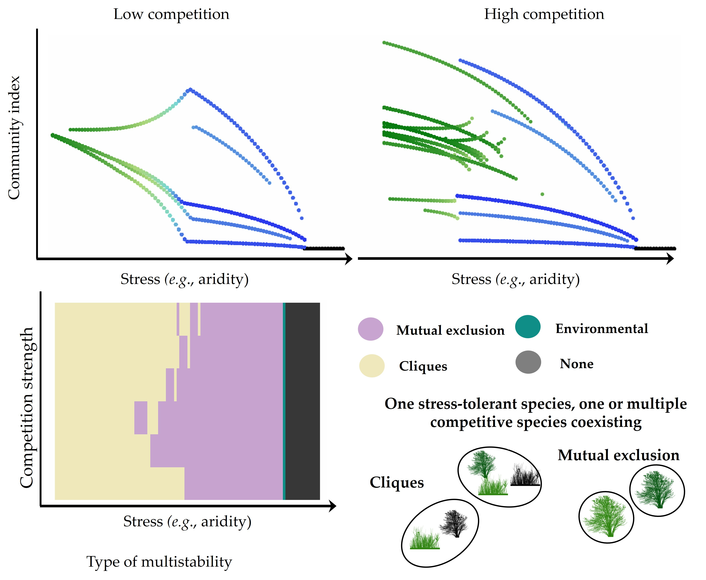

## Resilience in time

In time, ecosystems are exposed to perturbations such extreme drought or wet events. A part of my research focuses on understanding how ecosystems respond to these perturbations, as well as the plant community attributes (traits, composition) associated with higher resistance (ability to withstand perturbation) and/or resilience (ability to recover from perturbation).

In manuscripts in preparation, we investigated how dominance and dispersion of plant traits were associated with drought resistance and recovery time after droughts along a large aridity gradient.
We also investigated how the different facets of diversity (taxonomic, functional, phylogenetic) drive this different dimensions of stability.

## 

## Resilience in space

Dryland ecosystems, alongside others such as salt-marshes and mussel-beds, exhibit characteristic two-phase spatial mosaics with vegetation aggregated in patches and separated by open areas. We are interested in developping methods to link plant spatial patterns and resilience, as well as understanding how such spatial structure changes along stress gradients (**i.e.,** herbivory or aridity).

#### Vegetation patterns pinpoint the least resilient dryland sites

We developped an inverse-modelling approach relying on Approximate Bayesian Computing, which uses a snapshot of the spatial structure of ecosystems characterized by so-called irregular patterns, and estimate a distance to its desertification point regardless of whether it is reached via progressive or sudden degradation. The approach allows to comparably rank sites according to their resilience, which is here estimated as each site’s distance to its desertification point. We validated the approach on simulated landscapes from different models, showing that the approach performs well at ranking all landscapes. We applied the approach to a global dryland dataset and investigates the drivers of the estimated distances to desertification. We emphasized a possible application of our approach by crossing these distances to desertification with aridity projections to illustrate the possibility to integrate our approach into risk assessment of drylands.

#### Climatic legacies drive spatial aggregation of plants in drylands

In this work, we focused on the contribution of current and past climates in explaining present-day spatial vegetation patterns. So we were asking whether there was climate legacies on present-day spatial vegetation patterns.
We show that past climates from the mid-Holocene and Last Glacial Maximum have effects of similar magnitude as current climate on the vegetation cover, but have remarkably stronger imprint on the spatial aggregation of vegetation in drylands.
Furthermore, we found that climate legacies on plant spatial patterns might relate to climate long-lasting effects on soil multifunctionality and sand content.
This study emphasizes the different timescales of processes involved in vegetation patterning in drylands, which we should account for when assessing dryland functioning and resilience from these patterns.

[Climatic legacies drive spatial aggregation of plants in drylands](https://hal.science/hal-05357145/document). (2026) B. Pichon, S. Kéfi, I. Gounand, S. Donnet (**in press**) *Global Change Biology*

[Vegetation patterns pinpoint the least resilient dryland sites](https://besjournals.onlinelibrary.wiley.com/doi/full/10.1111/2041-210x.70205). (2026) B. Pichon, S. Donnet, I. Gounand, S. Kéfi *Methods in Ecology and Evolution*

#### Grazing and plant spatial patterns in drylands

In a recent article published in Global Change Biology, we investigated how grazing affects plant spatial patterns and what are the underlying mechanistic pathways explaining those responses (plant size, life-forms, facilitation among plants). To do so, we coupled spatial vegetation pattern analyses of ecosystem images with field data analyses of the size distribution and dominant life-forms of plants from 326 dryland plots sampled across the globe. We found that the effects of herbivores on vegetation spatial structure were contrary to the effects of aridity. Specifically, vegetation in grazed areas is clustered in larger patches, with fewer small patches, which skews the patch-size distribution towards larger patches. These effects differed between browsing and grazing herbivores. Grazing effects could partially be explained by the fact that grazing reduces average plant size, increases shrub density, and promotes facilitation between species of contrasting sizes. Similar effects are also confirmed by using model simulations when accounting for potential facilitation among plant species.

[Grazing Modulates the Multiscale Spatial Structure of Dryland Vegetation](https://onlinelibrary.wiley.com/doi/10.1111/gcb.70345). (2025) B. Pichon, S. Kéfi, I. Gounand, N. Gross, Y. Pinguet, J. Guerber, D. Eldridge, [...], S. Donnet, F. T. Maestre *Global Change Biology*

#### Multistability in dryland plant communities

Within communities, species are wrapped in a set of feedbacks with each other and with their environment. When such feedbacks are strong enough, they can generate alternative stable states. So far, research on alternative stable states has mostly focused on systems with a small number of species and a limited diversity of interaction types. Here, we analyze a spatial model of plant community dynamics in stressed ecosystems such as drylands, where each species is characterized by a strategy, and the different species interact through facilitation and competition for space and resources, such as water. We identify three different types of multistability emerging from the interplay of competition and facilitation. Under low-stress levels, plant communities organize in small groups of coexisting species, maintained by space, competition and facilitation (‘cliques’). Under higher stress levels, positive feedback from facilitation leads to the dominance of a single facilitating species (‘mutual exclusion states’). At the highest stress levels, the single facilitating species left in the system coexists with the desert state.

[The interplay of facilitation and competition drives the emergence of multistability in dryland plant communities](https://esajournals.onlinelibrary.wiley.com/doi/pdf/10.1002/ecy.4369). (2024) B. Pichon, I. Gounand, S. Donnet, S. Kéfi *Ecology*

