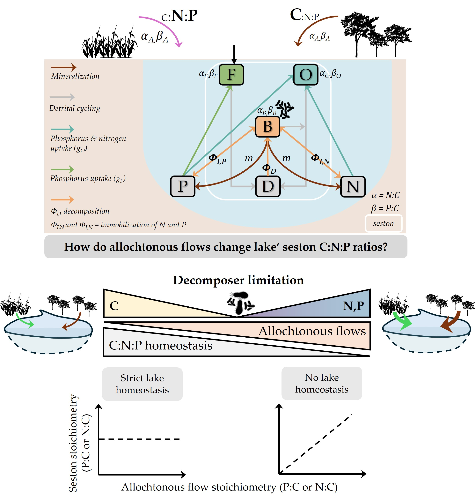
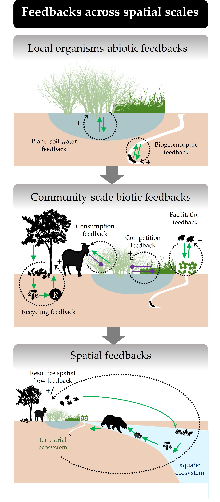
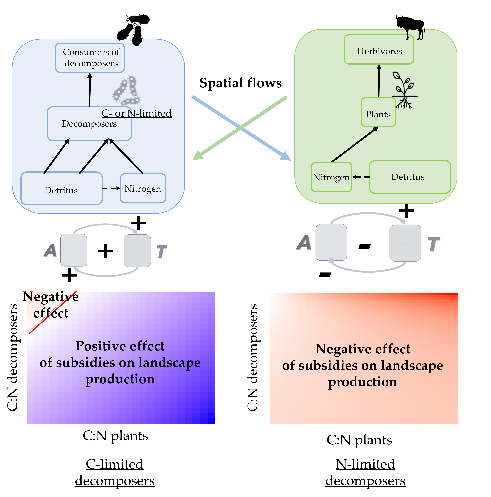

## Meta-ecosystem

I'm interested in understanding how the diversity of habitats, the type of spatial flows (dispersal, inorganic resources subsidies), and their characteristics (quantity and stoichiometry) affect the "functioning" of ecosystems and whole landscape. This is made possible by the development of models and the analyses of data gathered in global syntheses.

#### Allochthonous inflows and the Redfield ratio in lakes

[*Do allochthonous flows explain deviations from the Redfield ratio in lakes?* (*submitted)* B.]{.underline}Pichon, T. Daufresne, F.Guichard, I. Gounand

Lakes or streams show strong deviations of their stoichiometry compared to the Redfield ratio measured in oceans. Allochthonous inflows of resources might contribute to those deviations directly, by changing composition of detritus in ecosystems, but also indirectly, by shaping local community dynamics and stoichiometric constrains within aquatic ecosystems. In this work, we coupled empirical data of allochthonous flows exported to aquatic ecosystems with a stoichiometric model to understand those direct and indirect mechanisms through which allochthonous inflows affect seston stoichiometry. Our results emphasize that increasing allochthonous inflows promotes heterotrophic functioning, and relax decomposer’ carbon limitation. This release of stoichiometric constrain of decomposers (i) destabilizes the aquatic ecosystem by promoting competition between phytoplankton and decomposers, (ii) decreases the ability of the lake to regulate allochthonous flows, and (iii) push seston stoichiometry away from the Redfield ratio.

#### Feedbacks across levels of organization

[Integrating ecological feedbacks across scales and levels of organization](https://nsojournals.onlinelibrary.wiley.com/doi/pdf/10.1111/ecog.07167). (2024) B. Pichon, S. Kéfi, N. Loeuille, I. Lajaaiti, I. Gounand. *Ecography*

In this first work, we reviewed spatial feedbacks that emerge from the flows of resources and organisms across populations, communities, and ecosystems in space. We highlight the similarities across scales, the emergent properties that derive from these feedback loops: from local-scale patterning of organisms to landscape-scale functioning and stability.

{width="300"}

#### Effects of stoichiometry on spatial feedbacks between ecosystems

[Quality matters: Stoichiometry of resources modulates spatial feedbacks in aquatic‐terrestrial meta‐ecosystems](https://onlinelibrary.wiley.com/doi/pdf/10.1111/ele.14284) (2023) B.Pichon, E. Thébault, G. Lacrox, I. Gounand. *Ecology Letters*

So far, research on meta-ecosystems has mainly focused on the quantitative effect of subsidy flows. Yet, resource exchanges at heterotrophic-autotrophic (e.g., aquatic-terrestrial) ecotones display a stoichiometric asymmetry that likely matters for functioning. In this work, we coupled empirical data of allochthonous flows exported across ecosystems with a spatial stoichiometric model of coupled aquatic and terrestrial ecosystems to investigate how the stoichiometry of allochthonous flows influence the spatial feedbacks across the landscape. Our model results demonstrate that resource flows between ecosystems can induce a positive spatial feedback loop, leading to higher production at the meta-ecosystem scale by relaxing local ecosystem limitations (“spatial complementarity”). Furthermore, we show that spatial flows can also have an unexpected negative impact on production when accentuating the stoichiometric mismatch between local resources and basal species needs (negative feedbacks across ecosystems).

